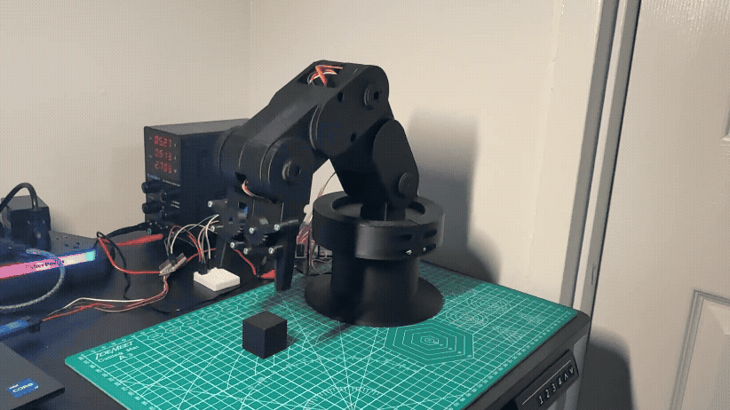
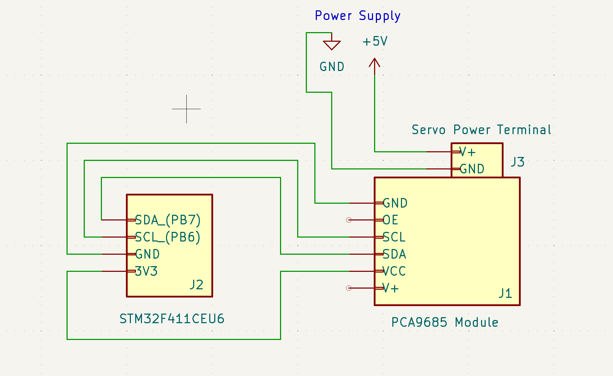

# STM32 4-DOF Robotic Arm: Custom Inverse Kinematics & Bare-Metal C

## Project Overview
This project is a custom-engineered 4-Degrees-of-Freedom (DOF) robotic arm built entirely from scratch. Rather than relying on high-level microcontrollers (like Arduino) or pre-built kinematic libraries, this arm is driven by **bare-metal C on an STM32 microcontroller**. 

The goal was to build a complete hardware abstraction layer and a custom Cartesian Inverse Kinematics (IK) engine to achieve smooth, linear pick-and-place tracking.

**Watch the full video demonstration on my LinkedIn:** 

---

## Software Architecture & Kinematics

### 1. Custom Inverse Kinematics Engine
To move the arm to specific `(X, Y, Z)` coordinates, the software flattens the 3D space and calculates the exact joint angles in real-time.
* **Base Angle:** Calculated using `atan2(Y, X)` to determine the required rotation.
* **Shoulder & Elbow:** Implements the **Law of Cosines** to calculate the required angles to reach the hypotenuse distance to the target coordinate.
* **Dynamic Pitch:** The wrist angle is decoupled and interpolated separately, allowing the arm to "present" the payload at specific angles during transit.

### 2. Hardware Synchronization & Linear Tracking
The biggest challenge in servo robotics is mitigating jitter and non-linear arcs. 
* **PWM Refresh Locking:** The PCA9685 driver expects a 50Hz signal (20ms). The `HAL_Delay` inside the interpolation loop is dynamically reduced to exactly compensate for the mathematical execution time and the 100kHz I2C transmission overhead, eliminating dropped frames.
* **Linear Interpolation:** To move in a perfectly straight Cartesian line, the software calculates micro-waypoints at 1mm increments. The continuous pursuit forces the shoulder and elbow to dynamically adjust their curves, locking the payload onto a laser-straight path.

---

## Hardware & Electronics

* **Microcontroller:** STM32 Nucleo (STM32F411)
* **Servo Driver:** PCA9685 (communicating via I2C at 100kHz)
* **Actuators:** 5x Standard Hobby Servos
* **Power:** 5V 3A Power Bench Supply

---

## Mechanical Design & Fabrication

I custom-designed the entire robotic chassis and claw mechanism from scratch using **Autodesk Fusion 360**. Instead of using off-the-shelf mechanical kits, I engineered custom servo mounts, joint linkages, and structural arms with specific tolerances. 

The parts were rapid-prototyped and fabricated using PLA and PETG filaments on a Bambu Lab A1 Mini. 

All of my original mechanical files are open-source and provided in multiple formats for easy modification or direct printing:
* `.f3d` - Raw Fusion 360 archive (Parametric timeline intact)
* `.step` - Universal CAD assembly
* `.3mf` - Pre-oriented and sliced project file ready for fabrication

---

## Repository Structure

* **/Firmware:** The complete STM32CubeIDE project (bare-metal C, HAL configuration).
* **/CAD_and_Hardware:** Fusion 360 models, STEP files, and 3D printing assets.
* **/Images:** Media, GIFs and wiring diagrams used in this documentation.

---

## Future Improvements
* Implement dynamic collision avoidance to prevent self-intersection.
* Upgrade I2C transmission to 400kHz Fast Mode for tighter loop execution.
* Incorporate non-blocking hardware timers (`HAL_GetTick()`) to replace standard delays.
